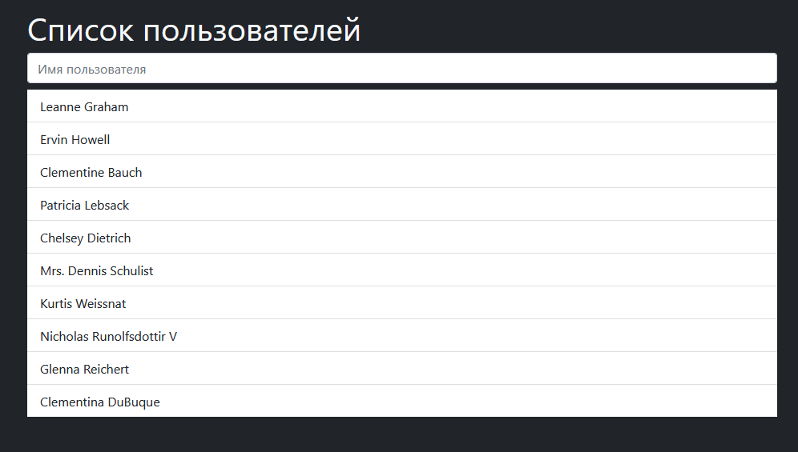

# https://bubenture.github.io/users

 

    
    

 

A single-page application that loads a list of users from an external API and allows filtering by name.

#### Loading Users:
When the site is opened, a request is automatically sent to the service at https://jsonplaceholder.typicode.com/users. A "Loading..." message is displayed for 2 seconds, after which the list of users appears.

#### Filtering:
At the top of the page, there is a search field. As text is entered, the list of users is filtered by name in real-time (without reloading the page).

#### Display:
Each user is displayed as a separate list item. If no users are found, a message "No users" is shown.

#### Features
- Fast filtering of users as you type.
- Asynchronous data loading from an external service.
- Responsive design thanks to Bootstrap.
- Loading messages and notifications for no users found.
- No server-side component — everything works on the client side.
